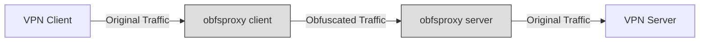

# obfsproxy

obfsproxy is a simple obfuscating proxy designed to provide a layer of obfuscation for network traffic. It works by applying multiple transformations to the data passing through it, making it harder for network monitors to identify the content of the communication.



## Features

- Multiple obfuscation methods:
  - Byte inversion
  - XOR encryption with custom key
  - Random data injection with configurable redundancy
- Bidirectional proxying with client/server modes
- Command-line interface for easy configuration
- Docker support for containerized deployment
- Integration tests to ensure proper functionality

## Installation

### Prerequisites

- Go 1.23.2 or later
- Docker (for containerized deployment and integration tests)

### Building from source

1. Clone the repository:
   ```
   git clone https://github.com/askolesov/obfsproxy.git
   cd obfsproxy
   ```

2. Build the project:
   ```
   make build
   ```

The compiled binary will be available in the `build/` directory.

## Usage

Run obfsproxy with the following command:

```
obfsproxy [flags]
```

- `-l, --listen`: Address to listen on (default: "localhost:8080")
- `-t, --target`: Address to forward to (default: "localhost:80")
- `-s, --server`: Run in server mode
- `-c, --client`: Run in client mode (default if neither -s nor -c specified)
- `-k, --key`: Encryption key (required)
- `-r, --redundancy`: Redundancy level for data injection in percent (0-1000, default: 50)

### Example

To set up a proxy chain:

1. Start the client (obfuscating proxy):
```
obfsproxy -l 0.0.0.0:8080 -t proxy2:8081 -k your-secret-key -r 50 -c
```

2. Start the server (deobfuscating proxy):
```
obfsproxy -l 0.0.0.0:8081 -t target:80 -k your-secret-key -r 50 -s
```

This will create a proxy chain where:
1. Traffic enters through the client on port 8080
2. Gets obfuscated and forwarded to the server on port 8081
3. Gets deobfuscated and forwarded to the target on port 80

## Docker

To build and run obfsproxy using Docker:

1. Build the Docker image:
   ```
   make docker
   ```

2. Run the container:
   ```
   docker run -p 8080:8080 obfsproxy:latest obfsproxy -l 0.0.0.0:8080 -t example.com:80 -k your-secret-key -r 50
   ```

## Development

### Running tests

To run the unit tests:

```
make test
```

### Running integration tests

To run the integration tests:

```
cd integration
make test
```

This will start the necessary Docker containers and run the integration tests.

### Linting

To run the linter:

```
make lint
```

## License

This project is licensed under the MIT License. See the [LICENSE](LICENSE) file for details.
